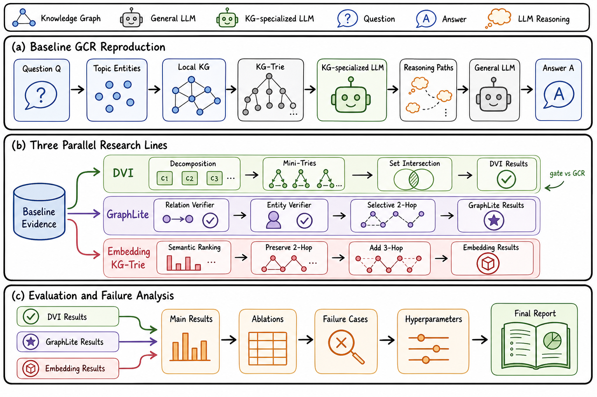
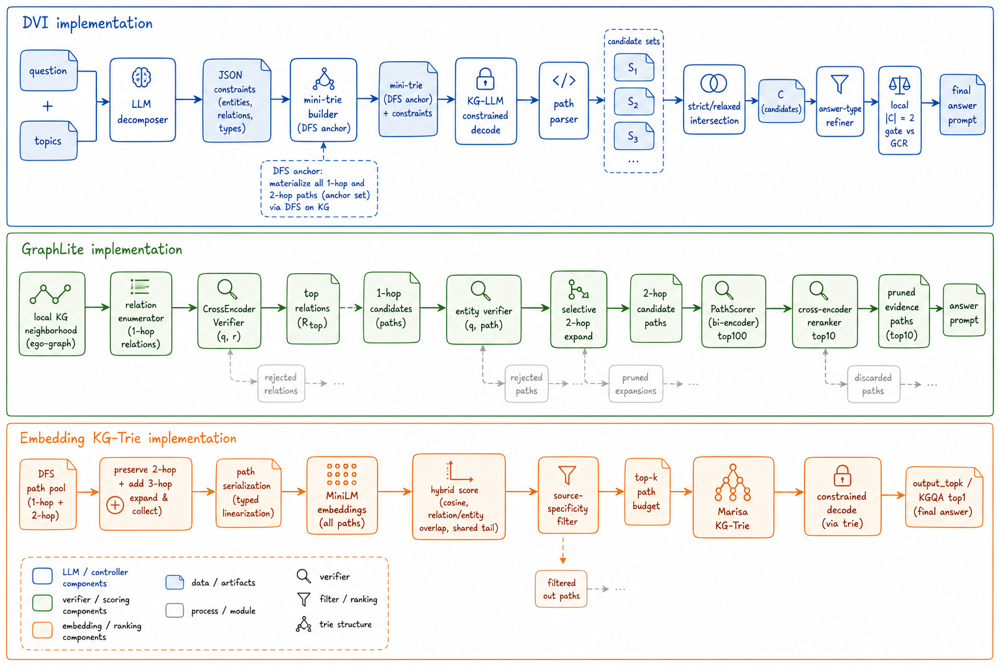
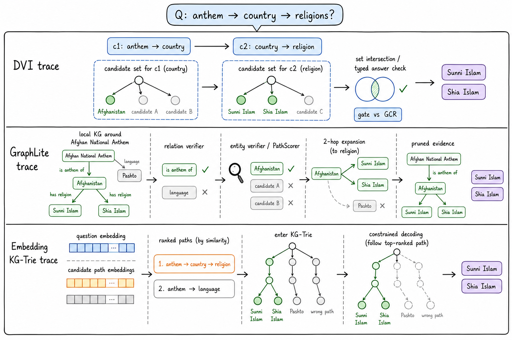

# TriGCR: Tri-Path Constraint-Aware Graph Reasoning for Faithful Knowledge-Grounded QA

This repository is a cleaned GitHub release package for **TriGCR**, a paper-style system for faithful knowledge-grounded question answering. The project was developed for an AIAA 4051 final research project on complex KGQA with graph-constrained reasoning. It keeps the original Graph-Constrained Reasoning (GCR) interface and organizes three implemented extensions:

1. **DVI (Decompose-Verify-Intersect)**: decomposes a complex question into atomic constraints, verifies each constraint on the knowledge graph, and intersects candidate answer sets with deterministic Python logic.
2. **GraphLite / PathScorer**: replaces expensive KG-LLM verification with explicit graph enumeration plus neural path/entity scoring.
3. **Embedding-guided KG-Trie**: ranks candidate paths by semantic similarity before trie construction so that useful 3-hop evidence can be added without uncontrolled path explosion.

The package intentionally excludes large datasets, generated predictions, model checkpoints, caches, API keys, and local runtime directories. It includes source code, lightweight experiment summaries, the final report PDF, and the figures used in the paper.

## Visual Overview

<p align="center">
  
</p>

<p align="center"><strong>Project overview:</strong> the three research tracks extend the reproduced GCR baseline from complementary directions. DVI adds explicit constraint state and intersection, GraphLite studies a faster verifier, and embedding-guided KG-Trie improves long-hop evidence selection.</p>

<p align="center">
  
</p>

<p align="center"><strong>Method architecture:</strong> implementation-level comparison of DVI, GraphLite/PathScorer, and embedding-guided KG-Trie construction.</p>

<p align="center">
  
</p>

<p align="center"><strong>Question-to-answer traces:</strong> how the three methods process the same KGQA problem through decomposition, verification, path scoring, candidate construction, and final answering.</p>


## Key Results

| System | Setting | F1 | Hit@1 | Time / sample |
|---|---|---:|---:|---:|
| GCR baseline + Llama-3.1-8B | RoG-CWQ full test | 54.55 | 55.88 | 2.06s |
| Routed DVI + Llama-3.1-8B | <code>&#124;C&#124;=2</code> gate | **54.63** | **56.22** | 6.58s |
| GCR baseline + Llama-2-7B | RoG-CWQ full test | 54.50 | **57.12** | 6.27s |
| Routed DVI + Llama-2-7B | <code>&#124;C&#124;=2</code> gate | **54.51** | 56.92 | 6.53s |
| GraphLite / PathScorer | Entity/path verifier | 42.14 | 45.09 | **3.09s** |
| Embedding-guided KG-Trie | CWQ20, 3-hop embedding top-1 | 45.56 | -- | probe |

Full experiment tables, ablations, oracle-routing headroom, and representative failure cases are in [`results_summary/EXPERIMENT_TABLES.md`](results_summary/EXPERIMENT_TABLES.md).

## Repository Layout

```text
TriGCR/
├── code/
│   ├── gcr-dvi/                 # Main GCR baseline + DVI + PathScorer integration
│   ├── embedding_kgtrie/        # Overlay patch for embedding-guided KG-Trie construction
│   └── graphlite/               # GraphLite prototype, extracted from lite_framework.rar
├── report/
│   ├── kg_reasoner_three_methods_report.pdf
│   ├── kg_reasoner_three_methods_report.tex
│   └── figures/                 # Overview, architecture, and trace figures used in the report
├── results_summary/
│   ├── RESULTS.md               # Compact metric summary from archived experiments
│   └── EXPERIMENT_TABLES.md      # GitHub-readable main tables and ablations
├── docs/
│   └── assignment_requirements.pdf
├── environment_GCR.yml
├── requirements_GCR.txt
├── LICENSE
└── README.md
```

## Main Code Entry Points

| Method | Files |
|---|---|
| GCR baseline | `code/gcr-dvi/workflow/predict_paths_and_answers.py`, `code/gcr-dvi/workflow/predict_final_answer.py`, `code/gcr-dvi/src/graph_constrained_decoding.py`, `code/gcr-dvi/src/trie.py` |
| DVI | `code/gcr-dvi/workflow/predict_dvi.py`, `code/gcr-dvi/src/dvi/decomposer.py`, `code/gcr-dvi/src/dvi/intersector.py`, `code/gcr-dvi/src/dvi/answer_aware.py`, `code/gcr-dvi/src/qa_prompt_builder.py` |
| GraphLite / PathScorer | `code/graphlite/lite_framework/entity_level_decoder.py`, `code/graphlite/lite_framework/cross_encoder_verifier.py`, `code/gcr-dvi/src/dvi/path_scorer.py`, `code/gcr-dvi/workflow/build_path_verifier_data.py`, `code/gcr-dvi/workflow/train_path_reranker.py` |
| Embedding-guided KG-Trie | `code/embedding_kgtrie/overlay/src/qa_prompt_builder.py`, `code/embedding_kgtrie/overlay/workflow/predict_paths_and_answers.py`, `code/embedding_kgtrie/kgtrie_enhanced_changes.patch` |

## Setup

The original environment was developed with Python 3.12 and the GCR dependency stack. Either install from the root requirement files:

```bash
conda env create -f environment_GCR.yml
conda activate GCR
pip install -r requirements_GCR.txt
```

or use the Poetry project under `code/gcr-dvi/`:

```bash
cd code/gcr-dvi
pip install poetry
poetry install
```

Create a local `.env` file from the provided example when running API-backed final-answer judging or decomposition:

```bash
cp code/gcr-dvi/.env.example code/gcr-dvi/.env
```

Do not commit `.env`, model checkpoints, generated prediction files, or raw datasets.

## Example Commands

Run the GCR-style path generation stage:

```bash
cd code/gcr-dvi
python workflow/predict_paths_and_answers.py \
  --data_path rmanluo \
  --d RoG-cwq \
  --split test \
  --model_name GCR-Meta-Llama-3.1-8B-Instruct \
  --model_path rmanluo/GCR-Meta-Llama-3.1-8B-Instruct \
  --k 10 \
  --index_path_length 2 \
  --prompt_mode zero-shot \
  --generation_mode group-beam
```

Run DVI:

```bash
cd code/gcr-dvi
python workflow/predict_dvi.py \
  --data_path rmanluo \
  --d RoG-cwq \
  --split test \
  --kg_model_name GCR-Meta-Llama-3.1-8B-Instruct \
  --kg_model_path rmanluo/GCR-Meta-Llama-3.1-8B-Instruct \
  --general_model_name gpt-4o-mini \
  --k 10 \
  --index_path_length 2 \
  --decompose_cache_path data/decompose_cache.json \
  --min_candidates 1
```

Train the integrated path reranker used by GraphLite-style verification:

```bash
cd code/gcr-dvi
python workflow/build_path_verifier_data.py --help
python workflow/train_path_reranker.py --help
```

Apply or inspect the embedding-guided KG-Trie overlay:

```bash
cd code/embedding_kgtrie
less kgtrie_enhanced_changes.patch
```

## Results and Report

The final paper is included at `report/kg_reasoner_three_methods_report.pdf`. A compact results table is in `results_summary/RESULTS.md`. The full archived raw outputs were deliberately not included because they are large and include generated predictions that are not needed for a clean GitHub release.

## Provenance

This project builds on the MIT-licensed Graph-Constrained Reasoning codebase. The included `LICENSE` is copied from the base project. Project-specific code and report artifacts are organized here for reproducibility and review.
